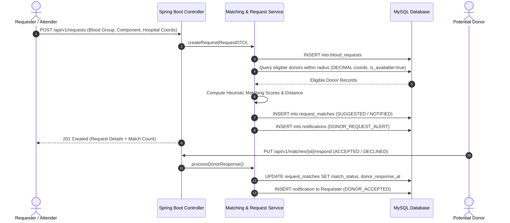

# BloodBridge System Architecture

## 1. Overview
BloodBridge follows a classical multi-tier decoupled architecture separating client interface, application logic, and relational persistence.

```
+-------------------------------------------------------------+
|                      Client Layer                           |
|       Modular HTML5 / CSS3 / JavaScript (ES6 Modules)       |
+-------------------------------------------------------------+
                              |
                     HTTPS / JSON (REST)
                              |
+-------------------------------------------------------------+
|                    Application Layer                        |
|                  Spring Boot REST Backend                   |
|                                                             |
|  +-------------------------------------------------------+  |
|  | Controller Layer (API endpoints, DTO mapping)         |  |
|  +-------------------------------------------------------+  |
|                             |                               |
|  +-------------------------------------------------------+  |
|  | Service Layer (Business rules, Matching calculations) |  |
|  +-------------------------------------------------------+  |
|                             |                               |
|  +-------------------------------------------------------+  |
|  | Repository Layer (Spring Data JPA / Hibernate)        |  |
|  +-------------------------------------------------------+  |
|                             |                               |
|  +-------------------------------------------------------+  |
|  | Security (JWT Token Filter, Role-Based Access)        |  |
|  +-------------------------------------------------------+  |
+-------------------------------------------------------------+
                              |
                       JDBC / HikariCP
                              |
+-------------------------------------------------------------+
|                     Persistence Layer                       |
|                   MySQL 8.0+ Database                       |
|         (Normalized Tables, Indexes, Constraints)           |
+-------------------------------------------------------------+
```

## 2. Core Architectural Principles
1. **Layered Isolation**: Controllers handle request validation and response formatting. Business rules and algorithmic calculations reside strictly in Service components. Data access is encapsulated in Repositories.
2. **DTO Pattern**: Raw database entities are never returned directly over API responses to prevent accidental data leakage and tight coupling.
3. **Stateless Authentication**: JWT tokens are used for stateless request authorization across all protected endpoints.
4. **Privacy-by-Design**: Precise donor coordinates are kept strictly internal; public search queries return approximate distance and general vicinity to prevent sensitive data exposure.
5. **Database-Enforced Integrity**: Referential foreign keys, atomic inventory updates, and `CHECK` constraints prevent corrupted states at the database tier.

## 3. Data & Request Lifecycle Flow



## 4. Database Documentation Links
- [Database Design & ER Diagram](file:///c:/Users/Thangella%20Venkatesh/OneDrive/Attachments/Desktop/Blood%20bridge/docs/database/DATABASE_DESIGN.md)
- [Comprehensive Data Dictionary](file:///c:/Users/Thangella%20Venkatesh/OneDrive/Attachments/Desktop/Blood%20bridge/docs/database/DATA_DICTIONARY.md)
- [MySQL Schema DDL Script (01_init_schema.sql)](file:///c:/Users/Thangella%20Venkatesh/OneDrive/Attachments/Desktop/Blood%20bridge/database/schema/01_init_schema.sql)
