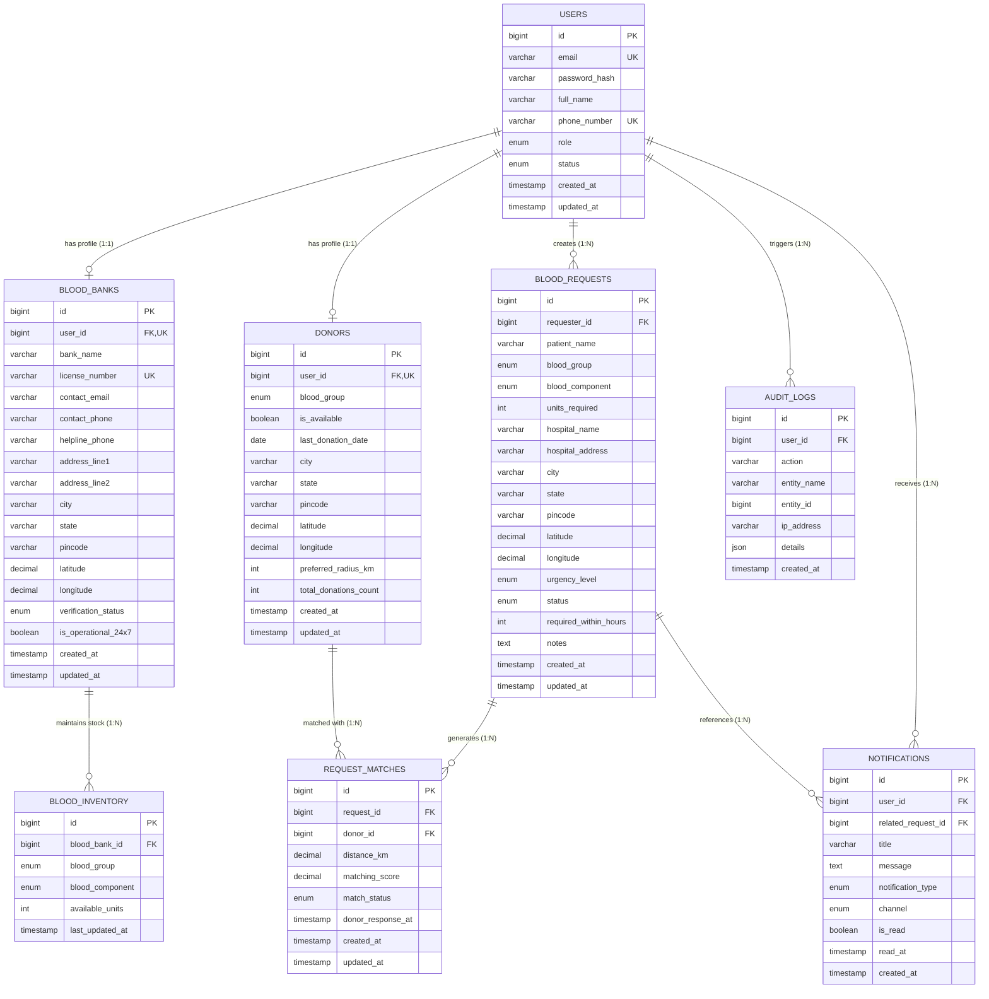

# BloodBridge Database Architecture & Design

## 1. Executive Summary

The **BloodBridge** database is designed for MySQL 8.0+ using the InnoDB engine with strict referential integrity, normalized tables (3NF), composite indexes for geospatial/matching performance, and non-nullable audit fields.

> **Medical Disclaimer:** The database schema tracks contact availability, request details, and discovery scores. The `matching_score` stored in `request_matches` is strictly an application-level heuristic ranking metric (factoring proximity, availability status, and donation cooldown intervals). It is **not** a medical compatibility validation or clinical transfusion clearance.

---

## 2. Entity-Relationship (ER) Diagram

---

## 3. Entity Definitions & Relationships

### 3.1 Relationships & Cardinality

| Parent Entity | Child Entity | Cardinality | Foreign Key | Delete Action | Business Rationale |
| :--- | :--- | :--- | :--- | :--- | :--- |
| `users` | `donors` | `1 : 0..1` | `donors.user_id` | `CASCADE` | Donor profile exists only if user account exists. |
| `users` | `blood_banks` | `1 : 0..1` | `blood_banks.user_id` | `CASCADE` | Blood bank facility profile is tied directly to user account. |
| `users` | `blood_requests` | `1 : 0..N` | `blood_requests.requester_id` | `RESTRICT` | Prevent deleting user accounts that have active or historical medical blood requests. |
| `blood_banks` | `blood_inventory` | `1 : 0..N` | `blood_inventory.blood_bank_id` | `CASCADE` | Inventory records belong exclusively to the parent facility. |
| `blood_requests` | `request_matches` | `1 : 0..N` | `request_matches.request_id` | `CASCADE` | Matches generated for a request are cleaned up if request is deleted. |
| `donors` | `request_matches` | `1 : 0..N` | `request_matches.donor_id` | `CASCADE` | Match link cleaned up if donor deregisters. |
| `users` | `notifications` | `1 : 0..N` | `notifications.user_id` | `CASCADE` | Direct user inbox notifications. |
| `blood_requests` | `notifications` | `1 : 0..N` | `notifications.related_request_id` | `SET NULL` | Preserves notifications even if request reference is archived. |
| `users` | `audit_logs` | `1 : 0..N` | `audit_logs.user_id` | `SET NULL` | Audit logs must persist even if a user account is deleted for compliance. |

---

## 4. Key Architectural & Database Design Decisions

### 4.1 ENUM vs Lookup Reference Tables
* **Decision:** Stored domain-fixed values as `ENUM` types (`Role`, `BloodGroup`, `BloodComponent`, `UrgencyLevel`, `RequestStatus`, `MatchStatus`, `NotificationType`, `VerificationStatus`).
* **Rationale:**
  1. Biological blood groups (`A+`, `A-`, `B+`, `B-`, `AB+`, `AB-`, `O+`, `O-`) and blood components are standard and static.
  2. Avoids unnecessary SQL `JOIN` operations on high-frequency matching queries.
  3. Maps seamlessly to Java `enum` types in Spring Boot using `@Enumerated(EnumType.STRING)`.
  4. Enforces data integrity at the database engine level.

### 4.2 Location & Donor Privacy Strategy
* **Decision:** `DECIMAL(10, 7)` for `latitude` and `longitude` combined with `city`, `state`, and `pincode`.
* **Rationale:**
  1. `DECIMAL(10, 7)` provides precision down to ~11 millimeters without floating-point rounding errors.
  2. Donors do **not** store street address / house numbers in the `donors` table. Only general locality (City, State, Pincode) and coordinates are retained.
  3. Spatial queries calculate distance between hospital coordinates and donor coordinates, presenting only approximate distance (`distance_km`) to the requester.

### 4.3 Inventory Uniqueness & Stock Tracking
* **Decision:** Composite unique constraint on `blood_inventory(blood_bank_id, blood_group, blood_component)`.
* **Rationale:**
  1. Prevents duplicate rows for the same component in the same blood bank.
  2. Updates use atomic `UPDATE blood_inventory SET available_units = available_units + ?` with a `CHECK (available_units >= 0)` constraint to prevent negative inventory.

### 4.4 Matching Score Architecture
* **Decision:** `request_matches` table stores `matching_score DECIMAL(5, 2)` (0.00 to 100.00) alongside `distance_km`.
* **Rationale:**
  1. Decouples search execution from immediate notification dispatch.
  2. Enables sorting and tiered dispatch (e.g., notify top 5 closest eligible donors first, expanding radius on timeout).
  3. Clear documentation: The matching score is a proximity and availability heuristic, **not** clinical cross-matching.

### 4.5 Normalization Analysis (3NF)
* All tables meet **Third Normal Form (3NF)**:
  - **1NF:** All attributes are atomic (no arrays or comma-separated strings).
  - **2NF:** All non-key attributes are fully functionally dependent on the primary key.
  - **3NF:** No transitive dependencies exist (e.g., user credentials reside in `users`; facility details reside in `blood_banks`).

---

## 5. Spring Data JPA / Hibernate Mapping Compatibility

| Database Table | Planned JPA Entity | Primary Key Strategy | Mapped Enums |
| :--- | :--- | :--- | :--- |
| `users` | `User.java` | `@GeneratedValue(strategy = GenerationType.IDENTITY)` | `Role`, `UserStatus` |
| `donors` | `Donor.java` | `@GeneratedValue(strategy = GenerationType.IDENTITY)` | `BloodGroup` |
| `blood_banks` | `BloodBank.java` | `@GeneratedValue(strategy = GenerationType.IDENTITY)` | `VerificationStatus` |
| `blood_inventory` | `BloodInventory.java` | `@GeneratedValue(strategy = GenerationType.IDENTITY)` | `BloodGroup`, `BloodComponent` |
| `blood_requests` | `BloodRequest.java` | `@GeneratedValue(strategy = GenerationType.IDENTITY)` | `BloodGroup`, `BloodComponent`, `UrgencyLevel`, `RequestStatus` |
| `request_matches` | `RequestMatch.java` | `@GeneratedValue(strategy = GenerationType.IDENTITY)` | `MatchStatus` |
| `notifications` | `Notification.java` | `@GeneratedValue(strategy = GenerationType.IDENTITY)` | `NotificationType`, `NotificationChannel` |
| `audit_logs` | `AuditLog.java` | `@GeneratedValue(strategy = GenerationType.IDENTITY)` | N/A |
